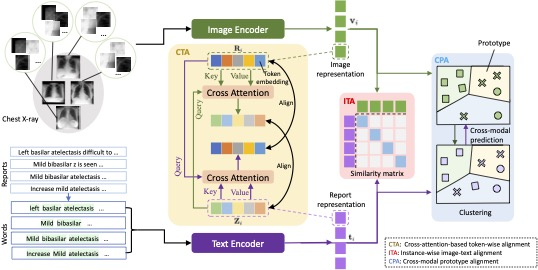

## MGCA
[Multi-Granularity Cross-modal Alignment for Generalized Medical Visual Representation Learning](https://arxiv.org/abs/2210.06044), NeurIPS 2022.



###  Installation
To clone this repository:
```
git clone https://github.com/fuying-wang/MGCA.git
```
To install Python dependencies:
```
pip install -r requirements.txt
```
To install package `mgca`:
```
pip install -e .
```
### Dataset downloading
Datasets we used are as follows:
- **MIMIC-CXR**: We downloaded the [MIMIC-CXR-JPG](https://physionet.org/content/mimic-cxr-jpg/2.0.0/) dataset as the radiographs. Paired medical reports can be downloaded in [MIMIC-CXR](https://physionet.org/content/mimic-cxr/2.0.0/mimic-cxr-reports.zip).

- **CheXpert**: We downloaded the [CheXpert](https://stanfordmlgroup.github.io/competitions/chexpert/) dataset which consisting of 224,316 chest radiographs of 65,240 patients.

- **RSNA**: We used the stage 2 of RSNA dataset in [Kaggle](https://www.kaggle.com/competitions/rsna-pneumonia-detection-challenge/data). 

- **COVIDx**: We used the version 6 of COVIDx dataset in [Kaggle](https://www.kaggle.com/datasets/andyczhao/covidx-cxr2).

- **SIIM**: We downloaded the stage 1 of SIIM dataset in [Kaggle](https://www.kaggle.com/competitions/siim-acr-pneumothorax-segmentation/data).

- **Object-CXR**: We downloaded the object-CXR dataset in its [official website](https://academictorrents.com/details/fdc91f11d7010f7259a05403fc9d00079a09f5d5).

After downloading datasets, please check if the path in `mgca/constants.py` is correct.

### Data Preprocessing
We preprocessed these datasets and split the dataset into train/val/test set using the code in `mgca/preprocess`.

### Pre-training

**Reminder**: Please check Line 47 of `mgca/datasets/pretrain_dataset.py` and make sure the path is correct.

We pre-trained MGCA on MIMIC-CXR using this command:
```
cd mgca/models/mgca
CUDA_VISIBLE_DEVICES=0,1 python mgca_module.py --gpus 2 --strategy ddp
```
We train our framework 50 epochs on 2 pieces of RTX 3090 GPUs with batch size of 144. It takes about *1 day* to pre-train this model.

Note that it is flexible to develop other pre-training models under this framework. You may create a folder in `mgca/models` and complete the `{MODEL_NAME}_module.py` file.

Pre-trained models can be found [here](https://drive.google.com/drive/folders/15_mP9Lqq2H15R53qlKn3l_xzGVzi9jX9?usp=sharing).

### Finetune on downstream tasks
We evlauate the performance of MGCA framework on three downstream tasks: classification, object detection and semantic segmentation. **Before finetuning, we need set the `path` (or `ckpt_path`) argument to the path of pre-trained MGCA model.**

#### Linear classification
We evaluate linear classification performance of our model using this command:
```
cd mgca/models/mgca
CUDA_VISIBLE_DEVICES=1 python mgca_finetuner.py --gpus 1 --dataset chexpert --data_pct 0.01
```
We can use `--dataset` to set specific dataset for finetuning. Here, 3 datsets are available: chexpert, rsna and covidx.
We can use `--data_pct` to set the fraction of training data for finetuning.

#### Object detection
We evaluate object detection performance of our model using this command:
```
cd mgca/models/mgca
CUDA_VISIBLE_DEVICES=0 python mgca_detector.py --devices 1 --dataset rsna --data_pct 1 --learning_rate 5e-4
```
Here, 2 datsets are available: rsna and object_cxr.

To run all experiments for this detection task:
```
sh run_det_funetune.sh
```

#### Semantic segmentation
We evaluate semantic segmentation performance of our model using this command:
```
cd mgca/models/mgca
CUDA_VISIBLE_DEVICES=0 python mgca_segmenter.py --gpus 1 --data_pct 1 --dataset rsna --batch_size 16 --learning_rate 5e-4
```
Here, 2 datsets are available: rsna and siim.

To run all experiments for this detection task:
```
sh run_seg_funetune.sh
```

### TODO List
- [ ] Refactor the train/valid/test lists.

### Reference
If you found our work useful in your research, please consider citing our works(s) at:
```bash
@article{wang2022multi,
  title={Multi-Granularity Cross-modal Alignment for Generalized Medical Visual Representation Learning},
  author={Wang, Fuying and Zhou, Yuyin and Wang, Shujun and Vardhanabhuti, Varut and Yu, Lequan},
  journal={arXiv preprint arXiv:2210.06044},
  year={2022}
}
```
